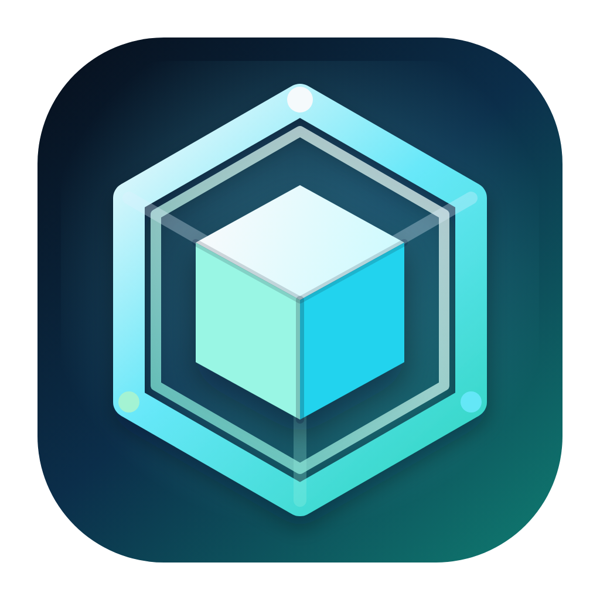

<div align="center">
  

  <h1>CC-Box</h1>
</div>

把 Claude Code 配置、项目设置和 Claude 二进制版本装进一个可同步、可回滚、可加密的工具箱。

CC-Box 面向经常在多台电脑上使用 Claude Code 的用户：你不再需要手动复制 `~/.claude/`，不需要反复配置 MCP、skills、commands，也不需要担心某次同步把本地配置覆盖坏。它用类似 Git 的快照方式管理 Claude Code 配置，并通过 WebDAV 在多设备之间同步。

当前版本：`v0.2.2`。这一版重点加固了同步安全、跨平台路径处理、二进制版本并发更新、GUI 单实例启动、托盘状态联动和配置文件页面筛选体验。

## 为什么需要 CC-Box

Claude Code 越用越顺手，配置也会越来越多：

- 全局指令写在 `CLAUDE.md`。
- API、权限、环境变量写在 `settings.json`。
- 自定义能力散落在 `skills/`、`commands/`、`agents/`、`plugins/`。
- 不同项目还有各自的 `.claude.json`。
- Claude 二进制版本也可能需要备份、切换或回滚。

换一台电脑时，这些东西往往很难完整迁移；手动复制容易漏文件，云盘同步又缺少冲突处理、历史版本和加密控制。

CC-Box 要解决的就是这个问题：**让 Claude Code 的配置像代码一样可同步、可追踪、可回滚。**

## 核心优势

| 优势 | 说明 |
| --- | --- |
| 多设备同步 | 通过 WebDAV 在多台设备之间同步 Claude Code 配置。 |
| 版本化快照 | 每次同步都有历史记录，可查看、对比和回滚。 |
| 端到端加密 | 上传前加密，远程只保存加密后的内容。 |
| 冲突可处理 | 本地和远程同时修改时，不是简单覆盖，而是保留冲突并支持选择。 |
| 安全同步语义 | HEAD 更新、二进制索引和初始化流程使用条件写入/锁，降低多设备并发覆盖风险。 |
| 二进制版本管理 | Claude 可执行文件也能备份、下载、切换和清理。 |
| 项目配置同步 | 支持项目级 `.claude.json`，多设备共享项目 MCP 配置。 |
| CLI + GUI 双入口 | 自动化用 CLI，日常桌面管理用 GUI。 |

## 你可以用它做什么

### 同步 Claude Code 全局配置

把 Claude Code 的关键配置同步到 WebDAV：

```text
~/.claude/
├── settings.json
├── CLAUDE.md
├── skills/
├── commands/
├── agents/
├── plugins/
└── ...
```

适合这些情况：

- 新电脑想快速恢复 Claude Code 使用环境。
- 台式机、笔记本、远程机器之间保持配置一致。
- 想备份自己的 prompt、skills、commands 和 MCP 设置。

### 像 Git 一样管理配置历史

CC-Box 不是简单地把文件上传覆盖。每次 push 都会生成快照，记录文件状态和父快照。

你可以：

- 查看历史快照。
- 对比本地和远程差异。
- 查看具体文件 diff。
- 回滚到任意快照。
- 在冲突时选择本地版本、远程版本或合并内容。

### 加密后再上传

同步到 WebDAV 前会先加密：

```text
加密密码 → Argon2id 派生 → AES-256-GCM 加密
```

这意味着远程 WebDAV 存储里保存的是加密数据，而不是直接暴露的 Claude Code 配置内容。

### 管理 Claude 二进制版本

除了配置文件，CC-Box 也能管理 Claude 二进制文件：

- 备份当前 Claude 可执行文件。
- 上传到 WebDAV。
- 下载指定历史版本。
- 在本地切换版本。
- 清理旧版本。

这适合需要保留可用版本、回滚版本或在多台设备间统一二进制版本的用户。

### 同步项目级 `.claude.json`

很多项目会有自己的 `.claude.json`，里面包含项目级 MCP、工具权限等配置。CC-Box 支持把这些项目配置也纳入同步范围，避免每台设备都重新配置一遍。

## CLI 和 GUI 怎么选

| 版本 | 适合谁 | 典型用途 |
| --- | --- | --- |
| CLI | 喜欢终端、脚本和自动化的用户 | 初始化、push/pull、查看状态、回滚、CI/脚本调用 |
| GUI | 喜欢可视化操作的桌面用户 | 查看状态、处理冲突、浏览 diff、管理二进制、托盘常驻 |

两个入口可以独立使用，但共享 `core/` 中的同步、加密、快照、WebDAV 和 Claude 二进制管理能力。你只想要命令行，就用 `cli/`；你只想用桌面界面，就用 `gui/`。

## 快速开始

### CLI 版

```bash
go -C cli build -o build/bin/cc-box.exe ./cmd/cc-box/

./cli/build/bin/cc-box.exe init
./cli/build/bin/cc-box.exe status
./cli/build/bin/cc-box.exe push
./cli/build/bin/cc-box.exe pull
```

常用命令：

```bash
cc-box init                 # 初始化 WebDAV、设备和加密密码
cc-box status               # 查看同步状态
cc-box push                 # 推送本地配置到远程
cc-box pull                 # 拉取远程配置到本地
cc-box sync                 # 拉取后推送
cc-box log                  # 查看快照历史
cc-box diff [FILE]          # 查看文件差异
cc-box conflicts            # 查看冲突
cc-box binary list          # 查看二进制版本
cc-box project list         # 查看项目配置
```

CLI 详细说明见：[cli/README.md](./cli/README.md)

### GUI 版

```bash
cd gui
wails build -clean -nopackage -m -nosyncgomod
```

构建后运行：

```text
gui/build/bin/cc-box-gui.exe
```

GUI 版提供初始化向导、同步概览、文件 diff、冲突处理、二进制版本管理、项目配置管理、历史快照、设置页和系统托盘。桌面端支持单实例启动：重复打开时会唤起已有窗口；同步状态会同步反映到页面和托盘。

GUI 详细说明见：[gui/README.md](./gui/README.md)

## 功能一览

| 功能 | CLI | GUI |
| --- | --- | --- |
| 首次初始化 | 支持 | 支持 |
| WebDAV 同步 | 支持 | 支持 |
| 快照历史 | 支持 | 支持 |
| 文件 diff | 支持 | 支持 |
| 冲突处理 | 支持 | 支持 |
| 加密密码管理 | 支持 | 支持 |
| Claude 二进制管理 | 支持 | 支持 |
| 项目级 `.claude.json` 同步 | 支持 | 支持 |
| 系统托盘 | 不适用 | 支持，状态与同步任务联动 |
| 单实例桌面应用 | 不适用 | 支持，重复启动会唤起已有窗口 |
| 文件变化监听 | 不适用 | 支持 |
| 脚本自动化 | 支持 | 不适用 |

## 项目结构

```text
cc-box/
├── core/                        # CLI 和 GUI 共享的核心能力
│   ├── binary/                  # Claude 二进制上传、下载、索引和平台识别
│   ├── config/                  # 本地配置、路径和 keyring 适配
│   ├── crypto/                  # 加密密码派生和数据加密
│   ├── normalize/               # 跨平台路径和换行辅助处理
│   ├── object/                  # 对象哈希和对象存储
│   ├── pathutil/                # 安全路径处理
│   ├── snapshot/                # 文件扫描、快照和 diff 数据
│   ├── sync/                    # 合并、冲突和历史处理
│   ├── webdav/                  # WebDAV 客户端和锁
│   ├── go.mod
│   └── go.sum
├── cli/                         # 命令行版
│   ├── README.md                # CLI 使用说明
│   ├── cmd/cc-box/              # CLI 入口
│   ├── internal/cli/            # Cobra 命令层
│   ├── internal/project/        # 项目级 .claude.json 同步
│   ├── go.mod
│   └── go.sum
├── gui/                         # 桌面 GUI 版
│   ├── README.md                # GUI 使用说明
│   ├── frontend/                # Svelte 前端
│   ├── internal/desktop/        # 桌面平台适配
│   ├── internal/project/        # GUI 项目配置管理
│   ├── main.go                  # Wails 入口
│   ├── wails.json
│   ├── go.mod
│   └── go.sum
└── README.md                    # 项目总览
```

## 技术栈

| 分类 | 技术 |
| --- | --- |
| 语言 | Go 1.25+ |
| CLI | Cobra、Viper |
| GUI | Wails v2、Svelte、Vite、Tailwind CSS |
| 文件监听 | fsnotify |
| 系统托盘 | systray |
| 加密 | Argon2id、AES-256-GCM |
| 远程存储 | WebDAV |

## 构建

当前根目录没有统一构建脚本，CLI 和 GUI 分别在各自 module 中构建：

```bash
go -C cli build -o build/bin/cc-box.exe ./cmd/cc-box/
cd gui && wails build -clean -nopackage -m -nosyncgomod
```

构建产物：

```text
cli/build/bin/cc-box.exe
gui/build/bin/cc-box-gui.exe
```

## 测试

从仓库根目录分别测试三个 Go module，并构建前端：

```bash
go -C core test ./...
go -C cli test ./...
go -C gui test ./...
npm --prefix gui/frontend run build
```

## 环境要求

| 依赖 | 说明 |
| --- | --- |
| Go 1.25+ | 构建和测试 CLI / GUI 后端。 |
| Wails CLI v2.x | 构建和开发 GUI。 |
| Node.js / npm | 安装和构建 GUI 前端依赖。 |
| WebDAV 服务 | 存储同步数据。 |
| Git | 项目级配置同步时用于识别项目 remote。 |

## 环境变量

| 变量 | 说明 |
| --- | --- |
| `CC_BOX_WEBDAV_PASSWORD` | WebDAV 密码。设置后可减少交互输入，适合 CLI 自动化场景。 |

## GitHub Release 下载代理

如果使用 GitHub Release 安装 Claude，CC-Box 需要访问 GitHub API、Release 资产和下载跳转域名。网络环境受限时，请把这些域名后缀加入代理规则：

```text
github.com
githubusercontent.com
githubassets.com
amazonaws.com
```

Clash 规则示例：

```yaml
- DOMAIN-SUFFIX,github.com,PROXY
- DOMAIN-SUFFIX,githubusercontent.com,PROXY
- DOMAIN-SUFFIX,githubassets.com,PROXY
- DOMAIN-SUFFIX,amazonaws.com,PROXY
```

如果通过环境变量让 CLI 或 GUI 进程走代理，需要在启动 CC-Box 前设置 `HTTP_PROXY` 和 `HTTPS_PROXY`，并重启终端或 GUI 让新进程继承环境变量。

## WebDAV 兼容性

理论上支持标准 WebDAV 服务，例如：

- Alist
- 坚果云
- NextCloud
- Synology WebDAV
- 自建 WebDAV 服务

实际兼容性取决于服务端对 WebDAV 方法、鉴权、ETag 和大文件上传的支持情况。多设备并发同步依赖服务端正确支持 `ETag`、`If-Match` 和 `If-None-Match`。

## 开发说明

当前仓库拆成三个 Go module：

- `core/`：CLI 和 GUI 共享的数据能力，包括配置、加密、对象、快照、同步、WebDAV 和 Claude 二进制管理。
- `cli/`：命令行应用，保留 Cobra 命令层和 CLI 专属逻辑。
- `gui/`：Wails 桌面应用，保留窗口、托盘、前端绑定和 GUI 专属逻辑。

根目录没有 Go module。只改命令行入口时进入 `cli/`，只改桌面体验时进入 `gui/`；改共享同步、加密、快照、WebDAV 或二进制能力时优先改 `core/`，并同时验证 CLI 和 GUI。

## License

MIT
