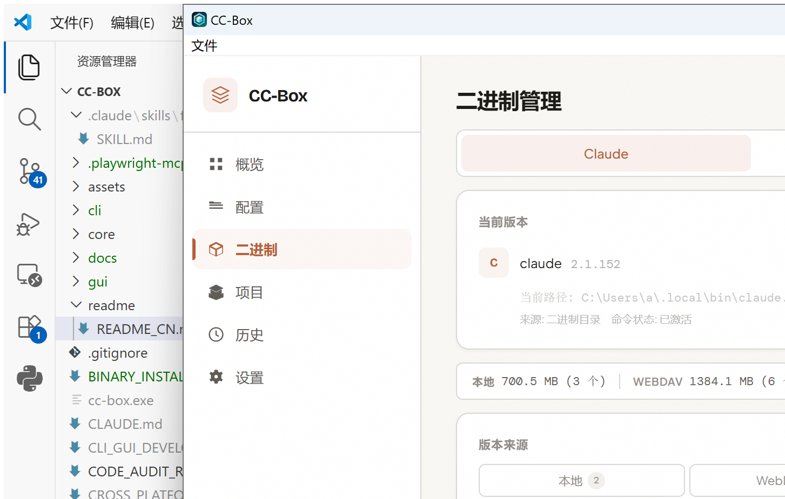
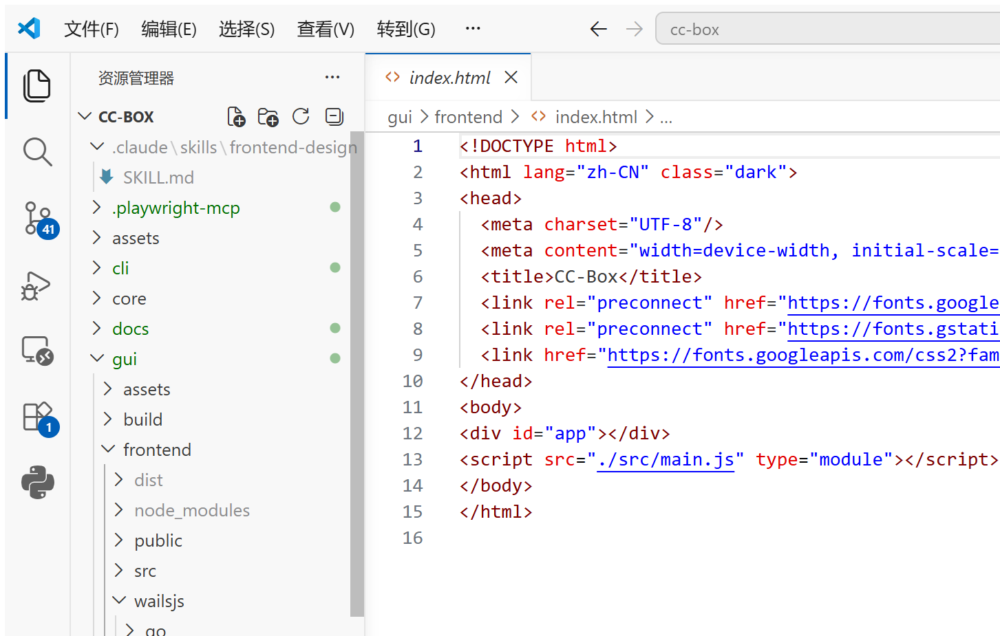

<div align="center">
  

  <h1>CC-Box</h1>

  <p><strong>Sync, encrypt, version, and rollback your entire Claude Code environment.</strong></p>

  <p>
    
    
    
    
  </p>

  <p>
    <b>English</b> | <a href="./readme/README_CN.md">中文</a>
  </p>
</div>

---

## What is CC-Box?

CC-Box takes everything that makes your Claude Code yours — global instructions in `CLAUDE.md`, API keys and permissions in `settings.json`, custom `skills/`, `commands/`, `agents/`, per-project `.claude.json` MCP configs, and even the Claude binary itself — and wraps it all into a **Git-like snapshot system** backed by your own **WebDAV storage** with **end-to-end encryption**.

No more manually copying `~/.claude/` between machines. No more cloud sync collisions silently corrupting your config. CC-Box gives you the same confidence for your Claude Code setup that Git gives you for your code: **every change is tracked, every version is recoverable, and nothing is lost.**

## Why CC-Box

The more you use Claude Code, the more your configuration grows. Soon you have:

- Global instructions in `CLAUDE.md`
- API keys, permissions, environment variables in `settings.json`
- Custom skills, commands, agents, and plugins scattered across subdirectories
- Per-project `.claude.json` with project-specific MCP servers and tool permissions
- A specific Claude binary version you want to keep or roll back to

When you switch computers, every one of these becomes a manual migration step. When two machines both make changes, you risk silent overwrites. CC-Box solves this end-to-end.

| Capability | Without CC-Box | With CC-Box |
|---|---|---|
| Moving configs to a new machine | Copy `~/.claude/` manually, forget something | One `pull` command or GUI click |
| History & rollback | None. Overwrite is forever. | Every push creates a snapshot. Revert to any point. |
| Multi-machine conflict | Manual merge, hope nothing breaks | Side-by-side diff, pick local/remote, or Git-style inline merge |
| Security in transit | Your WebDAV stores plain text | Argon2id + AES-256-GCM before upload |
| Claude binary versioning | Redownload from GitHub, hope the version still exists | Backup to WebDAV, restore anytime, offline-safe |
| Project MCP configs | Reconfigure on every machine | Sync `.claude.json` per project via git remote detection |

## How Sync Works

CC-Box doesn't just upload files. It builds a **content-addressed snapshot** of your entire `~/.claude/` directory and `~/.claude.json`, encrypts it, and pushes it to your WebDAV server.

```
Machine A                                    WebDAV Server                          Machine B
─────────                                   ──────────────                         ─────────
~/.claude/                                  snapshots/                             ~/.claude/
  settings.json  ──┐                       ├── abc123.json.enc  ──┐                 settings.json
  CLAUDE.md       │  scan → hash → encrypt │── def456.json.enc    │  decrypt → write  CLAUDE.md
  skills/         │                        │── ...                │                   skills/
  agents/         │  objects/              │── HEAD ── "abc123"   │                   agents/
~/.claude.json   ─┘  ├── a1b2c3...         │                      └─ ~/.claude.json
                     ├── d4e5f6...         │
                     └── ...               │
```

### Step by Step

1. **Scan & Hash** — Walk `~/.claude/` recursively. Compute a content hash for every file. Excluded paths (regex/wildcard) are skipped. Case-insensitive path collisions on case-insensitive file systems are caught and reported. Symlinks are rejected (they don't travel well across OSes).

2. **Diff Against Parent Snapshot** — Compare current file hashes against the last snapshot. Files are classified as `added`, `modified`, `deleted`, or `synced`. Only changed files are uploaded.

3. **Encrypt** — Your encryption password goes through Argon2id key derivation. The derived key encrypts snapshot metadata and object contents with AES-256-GCM. A unique random salt (stored in `salt.bin`) ensures the same password produces different ciphertexts across devices.

4. **Upload Objects** — Each file is stored as a content-addressed object (`objects/{hash}`). Identical files across snapshots share the same object — no duplicate uploads.

5. **Push Snapshot** — The snapshot JSON (file paths → hash + size + modtime mapping) is encrypted and uploaded to `snapshots/{id}.json.enc`.

6. **Update HEAD (Atomic)** — The `HEAD` pointer is updated to the new snapshot ID using ETag-based Compare-And-Swap. If another device pushed in the meantime, the CAS fails and CC-Box tells you to pull first. This prevents the "last writer wins silently" problem.

### Pull & Merge

When pulling, CC-Box does a **three-way merge** between the shared parent snapshot, your local state, and the remote state. If both you and another device modified the same file, CC-Box creates a conflict entry instead of silently picking a winner. You can then choose local, remote, or manually merge.

### Conflicts

Conflicts are surfaced both in the CLI and GUI. The GUI shows a side-by-side view with metadata (which side is newer, modification times), and a toggle to switch to **Git-style inline markers** (`<<<<<<< LOCAL` / `=======` / `>>>>>>> REMOTE`). Resolve one at a time, or resolve all at once.

### Object Store & Deduplication

Every file is content-addressed. Two snapshots that both contain the same file (same hash) share a single object on the server. This means:

- No duplicate uploads.
- Binary files and large configs are only stored once.
- Any missing object can be repaired from a local copy — CC-Box checks this automatically and offers to re-upload.

## Encryption in Detail

CC-Box does not trust the WebDAV server with your plaintext configs.

```
User Password ──→ Argon2id ──→ 256-bit Key
                                  │
                    ┌─────────────┴─────────────┐
                    ▼                           ▼
              AES-256-GCM                  AES-256-GCM
           (snapshot metadata)           (individual objects)
```

- **Key Derivation**: Argon2id with parameters tuned for security over speed (memory-hard, multiple passes, multiple threads). Each device uses the same shared salt (`salt.bin` on WebDAV) so the same password derives the same key everywhere.
- **Encryption**: Every snapshot JSON and every file object is encrypted independently with AES-256-GCM, which provides both confidentiality and authenticity (tamper detection).
- **Salt**: Shared via WebDAV. First device to initialize uploads a random salt. Subsequent devices joining the sync group download it. If the remote salt doesn't match, CC-Box warns you — you might have pointed at the wrong WebDAV root or used a different password.

**Important**: You choose and remember the encryption password. CC-Box does not store it, cannot recover it, and cannot decrypt your data without it. If you lose the password, the data is unrecoverable.

## Screenshots

<p align="center">
  
  <br/><i>Dashboard — sync health, connection status, pending changes, conflict count, device list</i>
</p>

<p align="center">
  
  <br/><i>Config file browser — tree view with status badges, file content, diff viewer, conflict resolution</i>
</p>

<p align="center">
  
  <br/><i>Claude binary management — WebDAV backups, GitHub Releases, official installer</i>
</p>

<p align="center">
  
  <br/><i>Snapshot history — timeline view, file lists per snapshot, rollback</i>
</p>

<p align="center">
  
  <br/><i>Settings — WebDAV connection, encryption password, sync strategy, exclude patterns</i>
</p>

## Claude Binary Management

Beyond config files, CC-Box manages the Claude binary itself — install, backup, switch, and rollback — all targeting the official Claude native install layout.

### Installation Targets

All install paths follow Claude's official convention:

| Platform | Binary Path |
|----------|------------|
| Windows | `~/.local/bin/claude.exe` |
| macOS | `~/.local/bin/claude` |
| Linux | `~/.local/bin/claude` |

This means `claude` on your `PATH` is the version CC-Box manages. No private directories, no shims.

### Three Install Sources

| Source | Best For | Details |
|--------|----------|---------|
| **Official Installer** | Getting the latest | Executes Claude's official install command. Quickest path to the newest stable release. |
| **GitHub Releases** | Pinning a specific version | Downloads from Claude's GitHub Release assets. Works for any published version. SHA256 verified against the release's `SHASUMS256.txt`. Good for testing, rollback, or locking a known-good version. |
| **WebDAV Backup** | Offline / air-gapped restore | Restores a version you previously uploaded. Does not depend on GitHub or official installer availability. |

### GitHub Release Platform Mapping

| Current Platform | GitHub Asset |
|-----------------|-------------|
| Windows x64 | `claude-win32-x64.zip` |
| macOS Apple Silicon | `claude-darwin-arm64.tar.gz` |
| Linux x64 | `claude-linux-x64.tar.gz` |

Windows ARM64, macOS Intel, Linux ARM64, and Linux musl are not currently supported. CC-Box only installs the binary for the platform it's running on.

### Install Flow & Safety

When installing a specific version (GitHub or WebDAV):

1. **Validate** the binary before install (SHA256 for GitHub, hash check for WebDAV).
2. **Backup** the current version if one exists.
3. **Write** the target binary to the official path.
4. **Run** `claude install` to initialize Claude's local directory structure.
5. **Re-verify** the binary at the target path still matches the intended version.
6. **Rollback** automatically on failure — no half-installed state.

For GitHub-sourced installs, CC-Box validates against `SHASUMS256.txt`. A note about signing: CC-Box checks SHA256 integrity; it does **not** verify GPG signatures on `SHASUMS256.txt.sig`. The UI clearly indicates this — it does not pretend that downloading a signature file equals verification.

### PATH Configuration

CC-Box attempts to ensure `~/.local/bin` is on your `PATH`. If it can't (e.g., shell config is non-standard), it warns but does not roll back the installed binary. The binary is still at the right location; you just need to add it to your PATH manually.

### What CC-Box Does NOT Manage

- Only `claude` / `claude.exe` — not `uv`, `uvx`, Codex, Gemini, or other tools.
- Binary restore does not restore `~/.claude/` or `~/.claude.json` — those are handled by the snapshot sync separately.
- If the current `claude` appears to be an npm shim, shell wrapper, or other non-native binary, CC-Box will not silently redirect to a private directory. It will install to the official path, replacing the shim.

## Project `.claude.json` Sync

Each project can have its own `.claude.json` with project-level MCP servers, allowed tools, and permissions. CC-Box discovers these via git remotes and syncs them through a separate `projects/` WebDAV namespace.

### Discovery

CC-Box scans `~/.claude/projects/` (where Claude Code stores per-project data), extracts the project root path, reads the git remote URL, and verifies `.claude.json` exists. Manually tracked projects (added via GUI) are merged in.

### Merge Strategy

When pulling a project `.claude.json`, CC-Box merges rather than overwrites:

| Field | Strategy |
|-------|----------|
| `mcpServers` | Remote wins, but servers that only exist locally are preserved |
| `allowedTools` | Union (both sets combined) |
| `permissions` | Remote wins, but keys only present locally are kept |

### CLI Commands

```bash
cc-box project list           # List all discovered project configs
cc-box project push           # Push all project .claude.json files
cc-box project pull           # Pull and merge remote project configs
cc-box project add <path>     # Manually track a project
```

## Feature Comparison: CLI vs GUI

| Feature | CLI | GUI |
|---------|-----|-----|
| Initialize sync group | ✓ | ✓ (onboarding wizard) |
| Push / Pull / Sync | ✓ | ✓ (toolbar + bulk actions) |
| Snapshot history | ✓ (`cc-box log`) | ✓ (History page with timeline) |
| File diff (line-by-line) | ✓ (`cc-box diff`) | ✓ (Files page, unified diff view) |
| Conflict resolution | ✓ (`cc-box conflicts`) | ✓ (side-by-side + Git-style inline) |
| File tree with status badges | — | ✓ (Files page) |
| Manage encryption password | ✓ | ✓ (Settings) |
| Exclude patterns | ✓ (config) | ✓ (Settings + per-file exclusion) |
| Claude binary install / backup / switch | ✓ | ✓ (Binaries page) |
| GitHub Release binary install | ✓ | ✓ (Binaries page) |
| Project `.claude.json` sync | ✓ | ✓ (Projects page) |
| Dashboard overview | — | ✓ (sync health, conflicts, devices) |
| System tray | — | ✓ (real-time state, single instance) |
| File change watching | — | ✓ (auto-sync trigger) |
| CI / script automation | ✓ | — |

Both CLI and GUI share the same `core/` module — sync semantics, encryption, snapshot format, and object storage are identical. You can mix CLI and GUI on the same machine without compatibility issues.

## Quick Start

### Download a Release

Pre-built binaries are available on [Releases](https://github.com/maliaosaide/cc-box/releases):

| File | Description |
|------|------------|
| `cc-box.exe` | CLI tool (command-line) |
| `cc-box-gui.exe` | Desktop app (Windows, WebView2 required) |

### CLI — First Sync

```bash
# 1. Initialize (WebDAV URL, username, password, encryption password, device name)
cc-box init

# 2. Push your current configs
cc-box push

# 3. On another machine, join the same WebDAV root
cc-box init   # Use the SAME encryption password and WebDAV root
cc-box pull
```

### CLI — Everyday Commands

```bash
cc-box status                     # What changed since last sync?
cc-box push                       # Upload local changes
cc-box pull                       # Download remote changes
cc-box sync                       # Pull then push (all-in-one)
cc-box log                        # Snapshot history
cc-box diff settings.json         # See what changed in a file
cc-box conflicts                  # List unresolved conflicts
cc-box revert <snapshot-id>       # Rollback to a previous snapshot

cc-box binary list                # Available Claude versions (WebDAV + GitHub)
cc-box binary push                # Backup current Claude binary to WebDAV
cc-box binary pull <version>      # Download and install a backed-up version
cc-box binary switch <version>    # Switch to a different local version
cc-box binary install --source official --latest
cc-box binary install --source github --version 1.2.3
cc-box binary uninstall <version> # Remove a local version

cc-box project list               # Projects with .claude.json
cc-box project push               # Upload all project configs
cc-box project pull               # Download and merge
```

### GUI

```bash
# Build
cd gui && wails build

# Run
./gui/build/bin/cc-box-gui.exe
```

The GUI guides you through an onboarding wizard: WebDAV connection → encryption password → device name → join existing sync group or start fresh. After that, you get a dashboard, file browser with diff/conflict views, binary manager, project sync, snapshot history, and a system tray with live status.

## Build from Source

### Prerequisites

| Dependency | Version | Notes |
|------------|---------|-------|
| Go | 1.25+ | Builds CLI and GUI backend |
| Wails CLI | v2.x | `go install github.com/wailsapp/wails/v2/cmd/wails@latest` |
| Node.js + npm | LTS | Frontend dependencies and build |
| Git | any | Project config discovery |

### Build Commands

```bash
# CLI (any platform)
go -C cli build -o cc-box.exe ./cmd/cc-box/

# GUI (platform-native — run on the target platform)
cd gui
npm --prefix frontend install
wails build

# Outputs:
#   cli/cc-box.exe
#   gui/build/bin/cc-box-gui.exe
```

### Run Tests

```bash
go -C core test ./...
go -C cli test ./...
go -C gui test ./...
npm --prefix gui/frontend run build     # Frontend type-check + build
```

## Tech Stack

| Layer | Technology |
|-------|------------|
| Language | Go 1.25+ |
| CLI Framework | [Cobra](https://github.com/spf13/cobra) + [Viper](https://github.com/spf13/viper) |
| GUI Framework | [Wails v2](https://wails.io) |
| Frontend | [Svelte](https://svelte.dev) + [Vite](https://vitejs.dev) + [Tailwind CSS](https://tailwindcss.com) |
| Encryption | Argon2id (key derivation) + AES-256-GCM (encryption) |
| Storage | WebDAV (any standards-compliant provider) |
| File Watching | [fsnotify](https://github.com/fsnotify/fsnotify) |
| System Tray | [systray](https://github.com/getlantern/systray) |

## Project Structure

```
cc-box/
├── core/                        # Shared module — no CLI/GUI dependencies
│   ├── binary/                  # Claude binary install, upload, download, index, platform detection
│   ├── config/                  # Local config, paths, keyring
│   ├── crypto/                  # Argon2id key derivation, AES-256-GCM encrypt/decrypt
│   ├── normalize/               # Cross-platform path and line-ending normalization
│   ├── object/                  # Content hashing and content-addressed object store
│   ├── pathutil/                # Safe path joining (prevents traversal)
│   ├── snapshot/                # File scanner, snapshot creation, diff computation
│   ├── sync/                    # Three-way merge, conflict detection, history
│   └── webdav/                  # WebDAV client with ETag, locking, retry, proxy support
├── cli/                         # CLI application module
│   ├── cmd/cc-box/              # Entry point
│   ├── internal/cli/            # Cobra commands (init, push, pull, sync, binary, project...)
│   └── internal/project/        # Project .claude.json discovery and merge
├── gui/                         # Wails desktop application module
│   ├── frontend/                # Svelte + Vite + Tailwind CSS
│   │   └── src/pages/           # Dashboard, Files, Binaries, Projects, History, Settings
│   ├── internal/desktop/        # Platform-specific desktop adapters
│   └── internal/project/        # GUI project config management
└── readme/                      # Translated READMEs
```

### Architecture Notes

CLI and GUI are **independent applications** that share the `core/` module. This means:

- Sync semantics, encryption, and snapshot format are defined once in `core/`.
- CLI is a thin Cobra command layer over `core/`.
- GUI is a Wails app with a Svelte frontend, calling Go backend methods that also use `core/`.
- Both produce and consume the same WebDAV data. You can push from CLI and pull from GUI on the same machine.

Changing a core behavior (sync, encryption, snapshot, WebDAV, binary) requires updating both CLI and GUI. UI-only changes (layouts, tray, onboarding) only touch `gui/`.

## WebDAV Compatibility

CC-Box uses standard WebDAV methods and headers. Any compliant provider should work:

| Provider | Status | Notes |
|----------|--------|-------|
| **Alist** | ✓ | Full support |
| **坚果云 (JianGuoYun)** | ✓ | Full support |
| **NextCloud** | ✓ | Full support |
| **Synology** | ✓ | Full support |
| **Self-hosted** | ✓ | Apache mod_dav, nginx-dav-ext, etc. |

### Requirements for Multi-Device Sync

Concurrent multi-device safety depends on the server correctly implementing:

- **ETag** — Conditional write headers
- **If-Match** / **If-None-Match** — Atomic HEAD updates via Compare-And-Swap
- **PROPFIND** (Depth 1) — Device list discovery

Without proper ETag support, single-device sync still works fine. Multi-device sync is best-effort — CC-Box will detect inconsistencies but cannot prevent them if the server ignores conditional headers.

### Timeouts & Proxies

- Default request timeout: **8 seconds** (dashboard) / per-request (sync operations).
- Proxy: set `HTTP_PROXY` and `HTTPS_PROXY` environment variables before starting CC-Box.
- The GUI and CLI must be launched from a shell where these variables are set for the process to inherit them.

## GitHub Release Download Proxy

When installing Claude from GitHub Releases, CC-Box accesses GitHub API, Release assets, and download redirect domains. If you're behind a proxy or firewall, add these domains:

```
github.com
githubusercontent.com
githubassets.com
amazonaws.com
```

Clash rule example:

```yaml
- DOMAIN-SUFFIX,github.com,PROXY
- DOMAIN-SUFFIX,githubusercontent.com,PROXY
- DOMAIN-SUFFIX,githubassets.com,PROXY
- DOMAIN-SUFFIX,amazonaws.com,PROXY
```

## Environment Variables

| Variable | Purpose |
|----------|---------|
| `CC_BOX_WEBDAV_PASSWORD` | WebDAV password. Set to skip interactive password prompts in CLI automation. |
| `HTTP_PROXY` / `HTTPS_PROXY` | HTTP/HTTPS proxy for WebDAV requests and GitHub downloads. |

## License

MIT

---

## Star History

<p align="center">
  <a href="https://star-history.com/#maliaosaide/cc-box&Date">
    
  </a>
</p>
